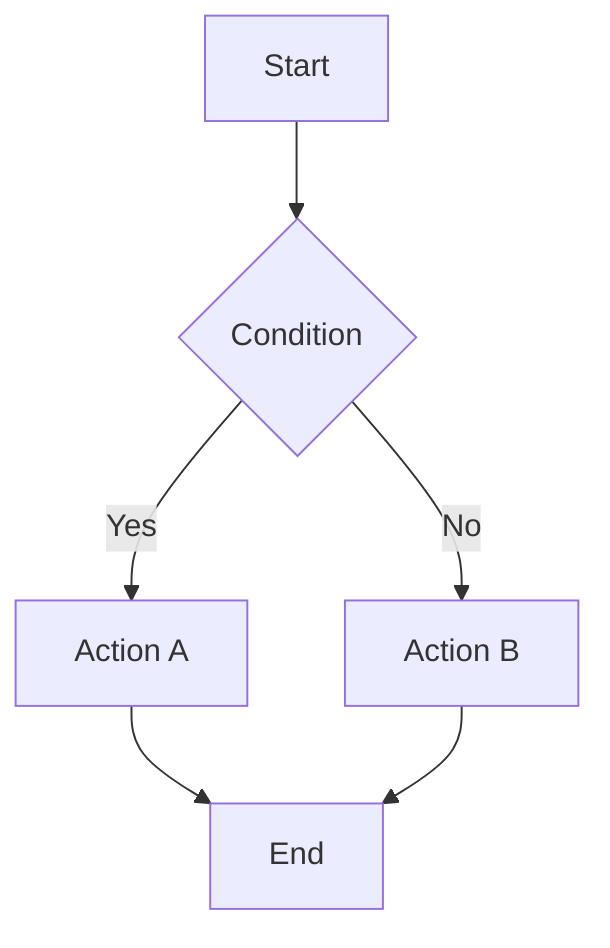
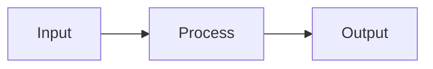
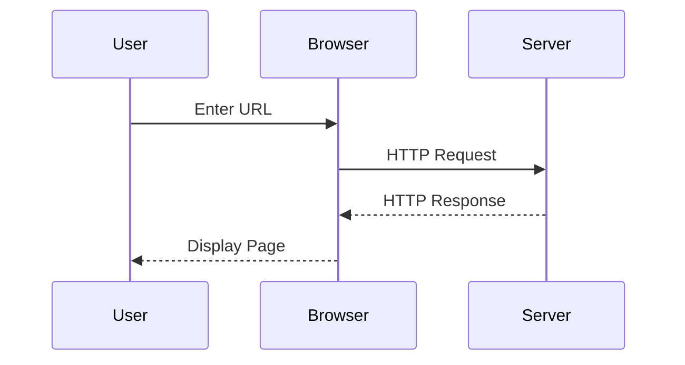
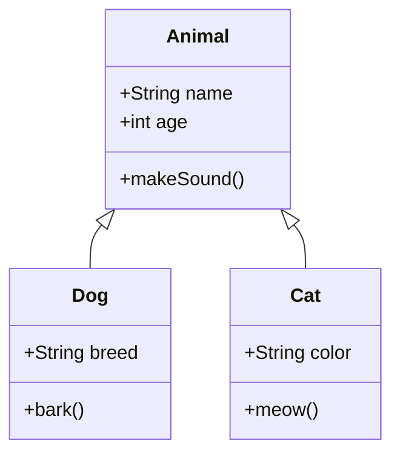
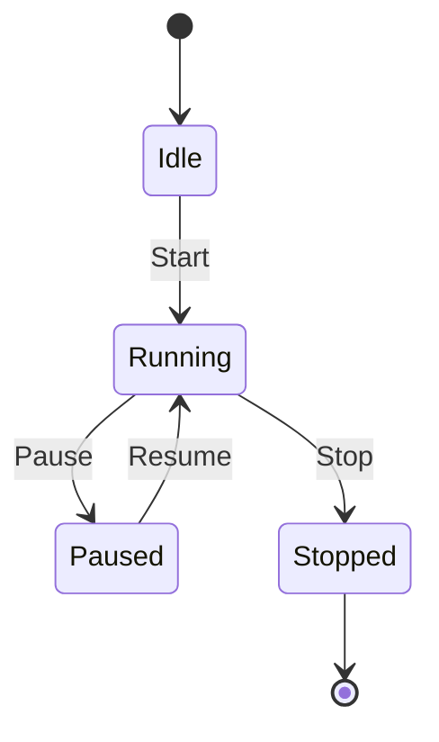
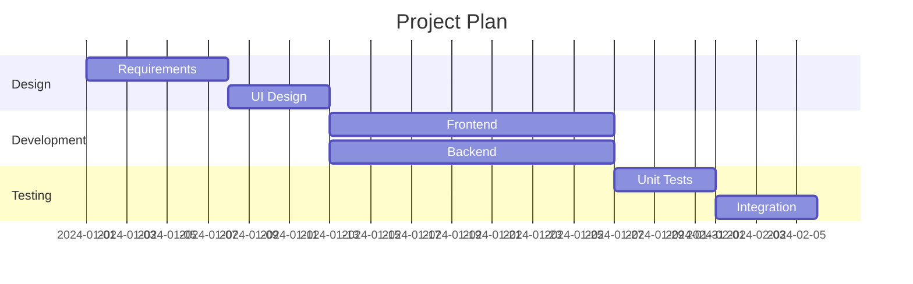
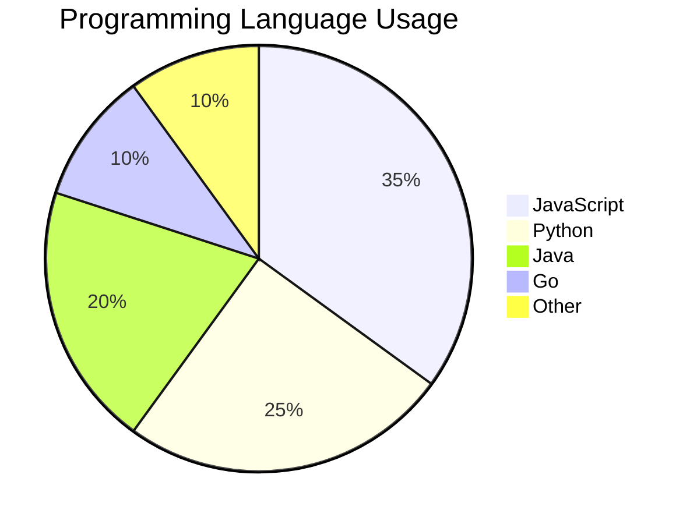
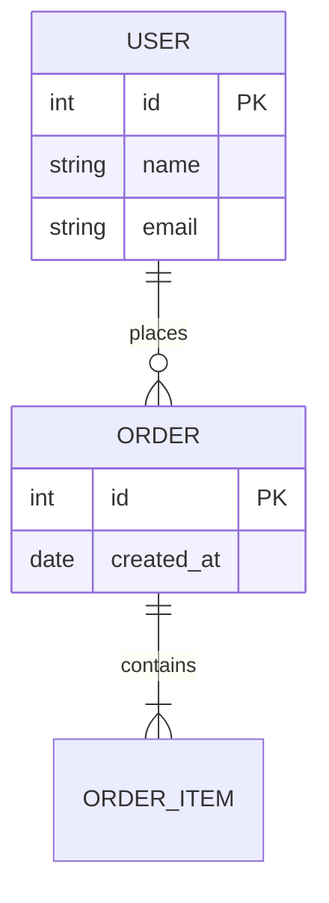
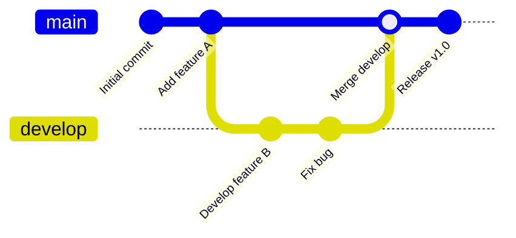

This article details Hugo Fluid theme's Mermaid diagram features.

<!--more-->

## Quick Start

### 1. Enable Mermaid

Enable Mermaid support in `params.toml`:

```toml
[post.mermaid]
enable = true
specific = true
[post.mermaid.options]
theme = "default"
```

### 2. Use in Articles

If `specific = true`, add to article Front-matter:

```yaml
---
title: "My Article"
mermaid: true
---
```

---

## Flowchart

### Basic Flowchart



### Left to Right Flowchart



---

## Sequence Diagram



---

## Class Diagram



---

## State Diagram



---

## Gantt Chart



---

## Pie Chart



---

## ER Diagram



---

## Git Graph



---

## References

- [Mermaid Documentation](https://mermaid.js.org/)
- [Mermaid Live Editor](https://mermaid.live/)
