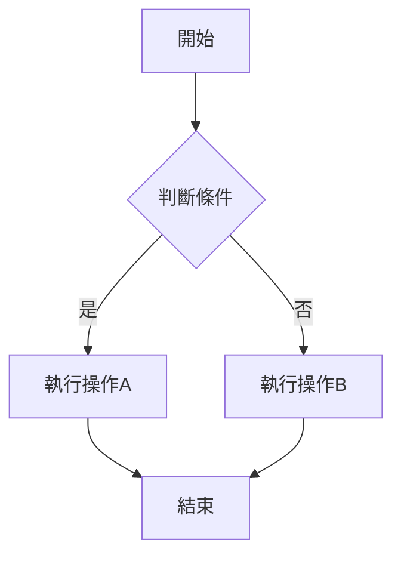
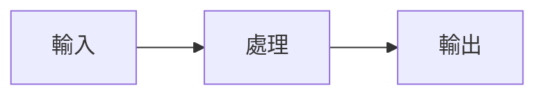
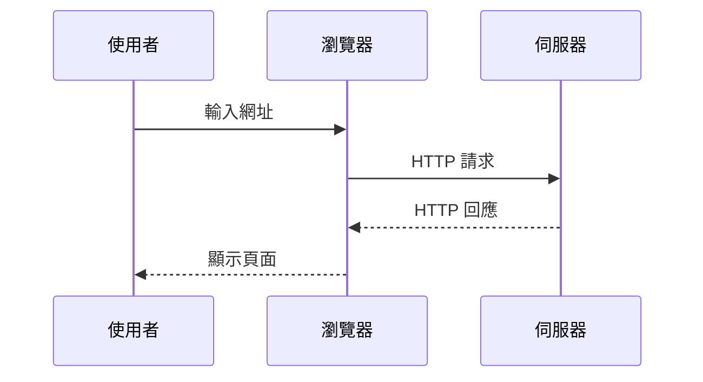
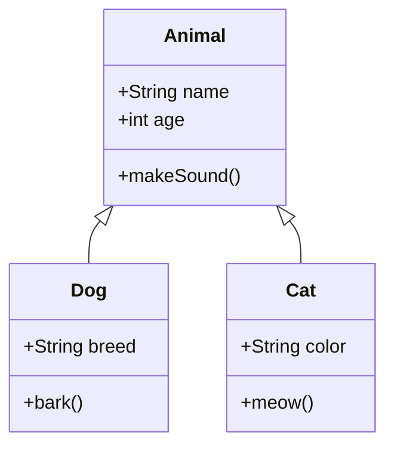
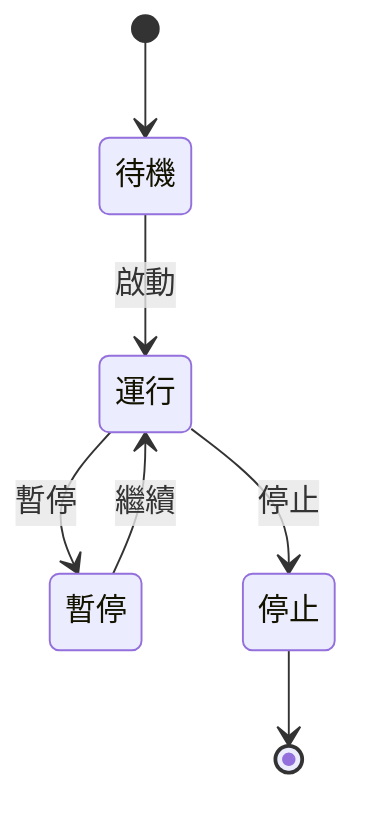
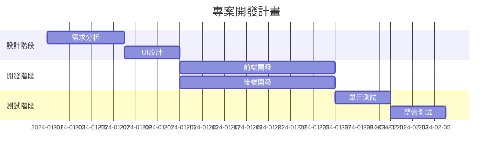
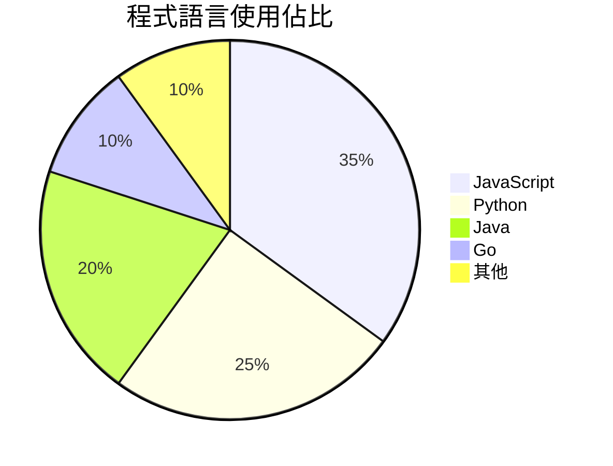
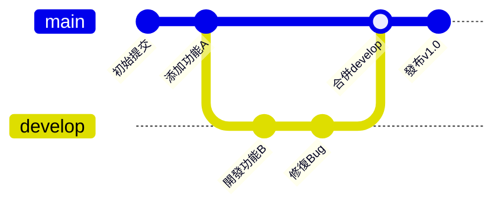

本文詳細介紹 Hugo Fluid 主題的 Mermaid 流程圖功能。

<!--more-->

## 快速開始

### 1. 啟用 Mermaid

在 `params.toml` 中啟用 Mermaid 支援：

```toml
[post.mermaid]
enable = true
specific = true
[post.mermaid.options]
theme = "default"
```

### 2. 在文章中使用

如果 `specific = true`，需要在文章的 Front-matter 中添加：

```yaml
---
title: "我的文章"
mermaid: true
---
```

---

## 流程圖 (Flowchart)

### 基礎流程圖



### 從左到右的流程圖



---

## 時序圖 (Sequence Diagram)



---

## 類別圖 (Class Diagram)



---

## 狀態圖 (State Diagram)



---

## 甘特圖 (Gantt Chart)



---

## 圓餅圖 (Pie Chart)



---

## Git 圖 (Git Graph)



---

## 參考資源

- [Mermaid 官方文檔](https://mermaid.js.org/)
- [Mermaid 線上編輯器](https://mermaid.live/)
