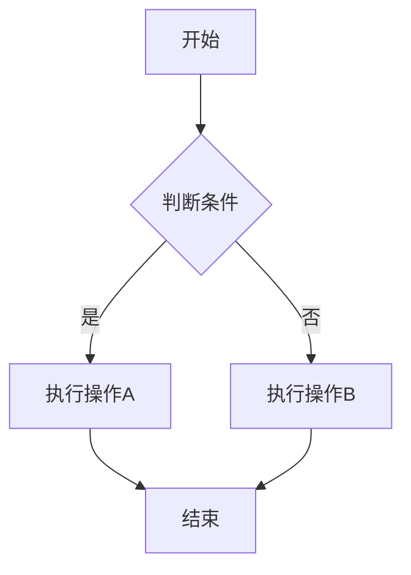
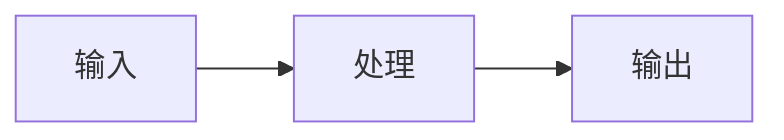
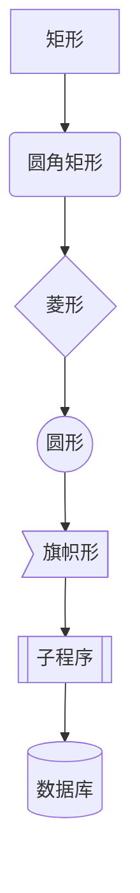
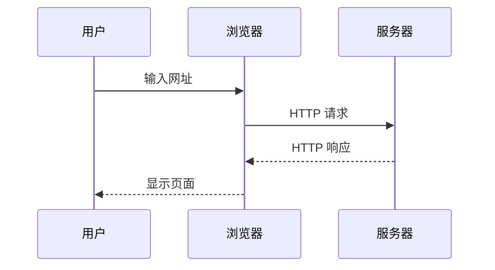
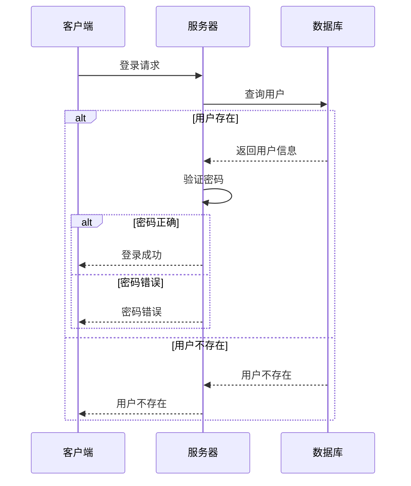
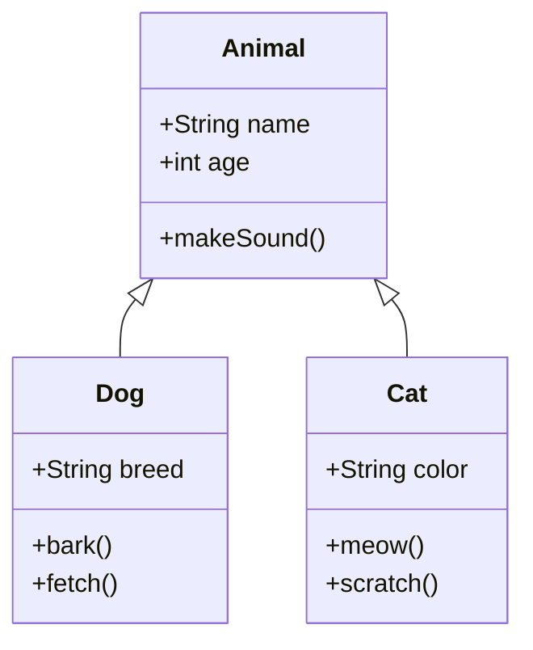
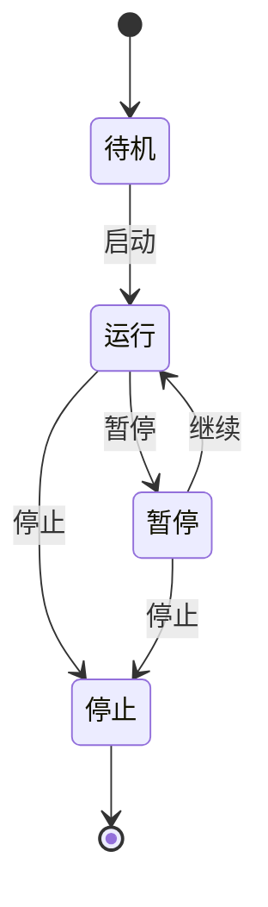
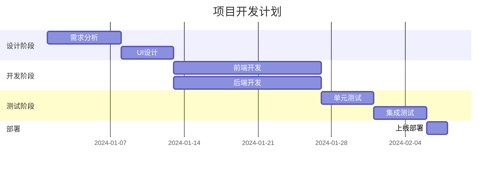
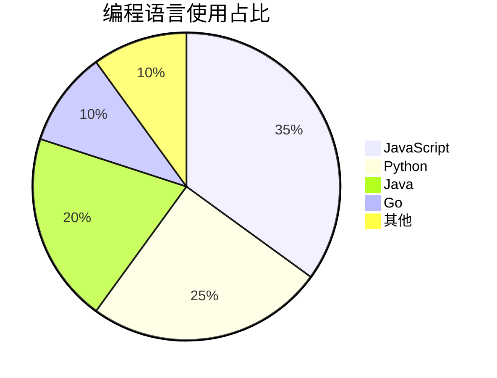
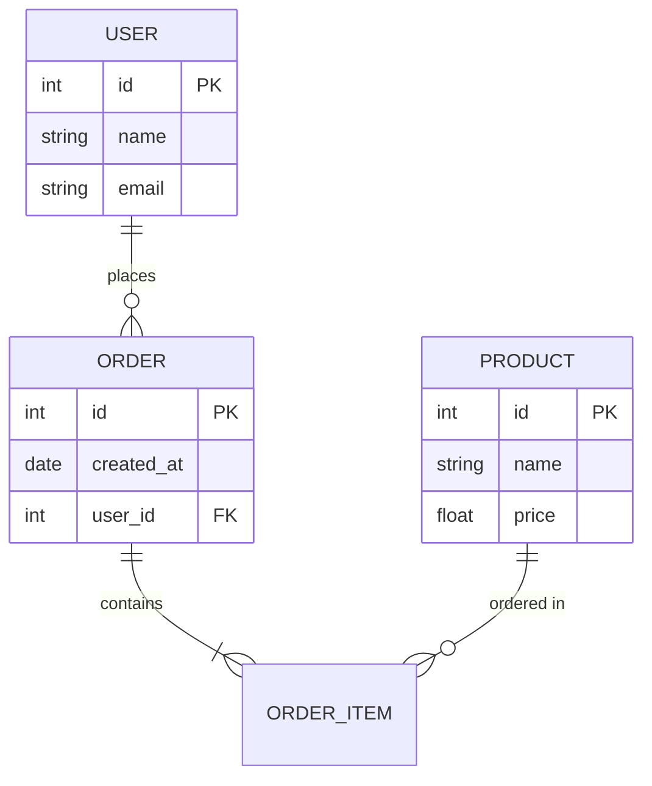

本文详细介绍 Hugo Fluid 主题的 Mermaid 流程图功能，包括配置方法、语法说明和丰富的示例。

<!--more-->

## 快速开始

### 1. 启用 Mermaid

在 `params.toml` 中启用 Mermaid 支持：

```toml
[post.mermaid]
enable = true
specific = true  # 设为 true 则需要在文章中单独启用
[post.mermaid.options]
theme = "default"  # 可选: default, dark, forest, neutral
```

### 2. 在文章中使用

如果 `specific = true`，需要在文章的 Front-matter 中添加：

```yaml
---
title: "我的文章"
mermaid: true
---
```

然后在文章中使用 Markdown 代码块，语言标记为 `mermaid`。

---

## 流程图 (Flowchart)

### 基础流程图

**写法：**

````markdown

````

**效果：**


### 从左到右的流程图

**写法：**

````markdown

````

**效果：**


### 节点形状

**写法：**

````markdown

````

**效果：**



---

## 时序图 (Sequence Diagram)

### 基础时序图

**写法：**

````markdown

````

**效果：**


### 带循环和条件的时序图

**写法：**

````markdown

````

**效果：**


---

## 类图 (Class Diagram)

**写法：**

````markdown

````

**效果：**


---

## 状态图 (State Diagram)

**写法：**

````markdown

````

**效果：**


---

## 甘特图 (Gantt Chart)

**写法：**

````markdown

````

**效果：**


---

## 饼图 (Pie Chart)

**写法：**

````markdown

````

**效果：**


---

## 实体关系图 (ER Diagram)

**写法：**

````markdown

````

**效果：**


---

## Git 图 (Git Graph)

**写法：**

````markdown
```mermaid
gitGraph
    commit id: "初始提交"
    commit id: "添加功能A"
    branch develop
    checkout develop
    commit id: "开发功能B"
    commit id: "修复Bug"
    checkout main
    merge develop id: "合并develop"
    commit id: "发布v1.0"
```
````

**效果：**

```mermaid
gitGraph
    commit id: "初始提交"
    commit id: "添加功能A"
    branch develop
    checkout develop
    commit id: "开发功能B"
    commit id: "修复Bug"
    checkout main
    merge develop id: "合并develop"
    commit id: "发布v1.0"
```

---

## 用户旅程图 (User Journey)

**写法：**

````markdown
```mermaid
journey
    title 用户购物旅程
    section 浏览商品
      访问首页: 5: 用户
      搜索商品: 4: 用户
      查看详情: 4: 用户
    section 下单购买
      加入购物车: 5: 用户
      填写地址: 3: 用户
      支付订单: 4: 用户
    section 收货评价
      等待发货: 3: 用户
      确认收货: 5: 用户
      评价商品: 4: 用户
```
````

**效果：**

```mermaid
journey
    title 用户购物旅程
    section 浏览商品
      访问首页: 5: 用户
      搜索商品: 4: 用户
      查看详情: 4: 用户
    section 下单购买
      加入购物车: 5: 用户
      填写地址: 3: 用户
      支付订单: 4: 用户
    section 收货评价
      等待发货: 3: 用户
      确认收货: 5: 用户
      评价商品: 4: 用户
```

---

## 主题配置

Mermaid 支持多种主题，可以在配置中设置：

```toml
[post.mermaid.options]
theme = "default"  # 可选值: default, dark, forest, neutral
```

### 主题效果

- **default**: 默认主题，适合浅色背景
- **dark**: 深色主题，适合深色背景
- **forest**: 绿色主题，清新自然
- **neutral**: 中性主题，简洁大方

> 注意：Hugo Fluid 主题会根据当前的深色/浅色模式自动切换 Mermaid 主题。

---

## 常见问题

### 1. 图表不显示

- 检查是否在 `params.toml` 中启用了 `post.mermaid.enable = true`
- 如果 `specific = true`，检查文章 Front-matter 是否有 `mermaid: true`
- 检查代码块语言是否正确标记为 `mermaid`

### 2. 图表显示错误

- 检查 Mermaid 语法是否正确
- 注意缩进和空格
- 参考 [Mermaid 官方文档](https://mermaid.js.org/) 获取正确语法

### 3. 深色模式下图表不清晰

主题会自动根据当前模式切换 Mermaid 主题，如果仍有问题，可以尝试手动设置主题。

---

## 参考资源

- [Mermaid 官方文档](https://mermaid.js.org/)
- [Mermaid 在线编辑器](https://mermaid.live/)
- [Mermaid GitHub](https://github.com/mermaid-js/mermaid)
